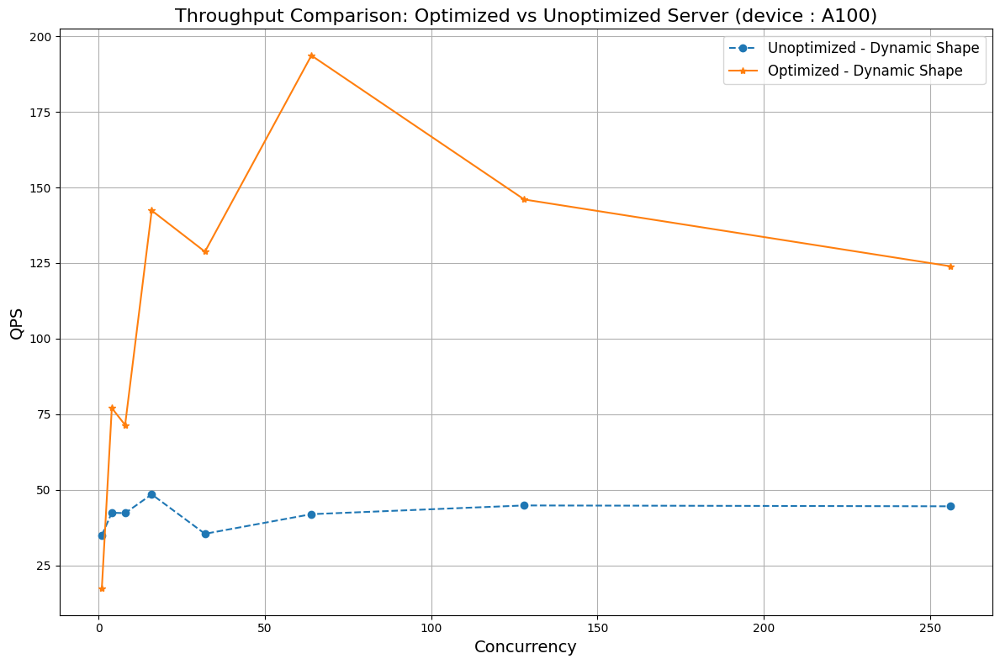
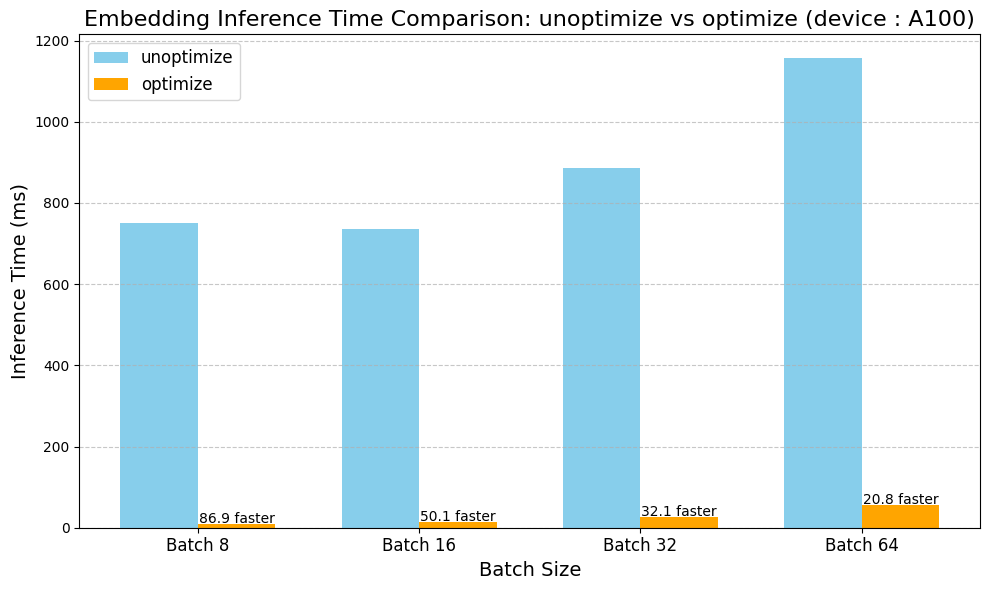
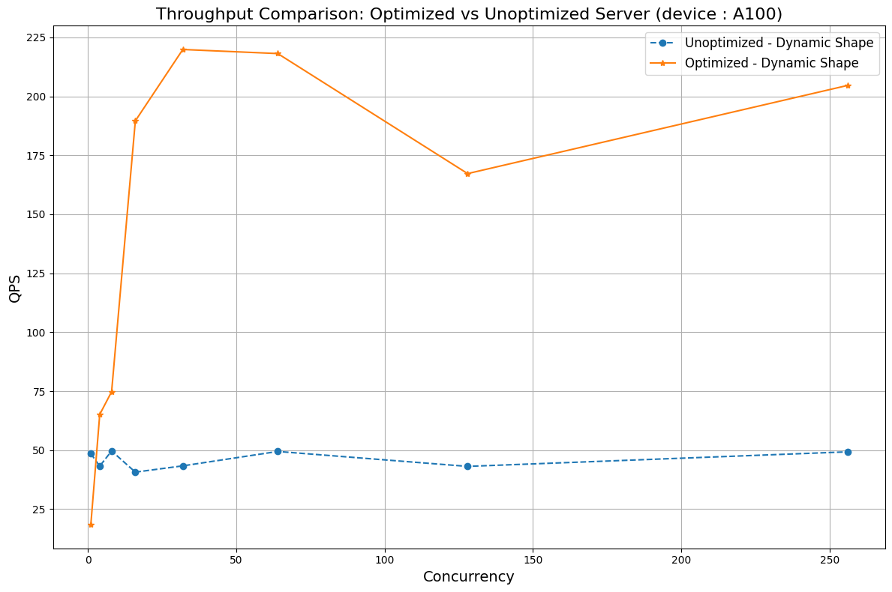
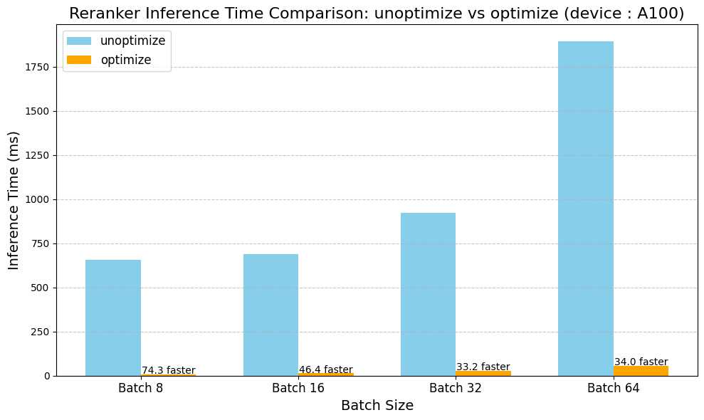
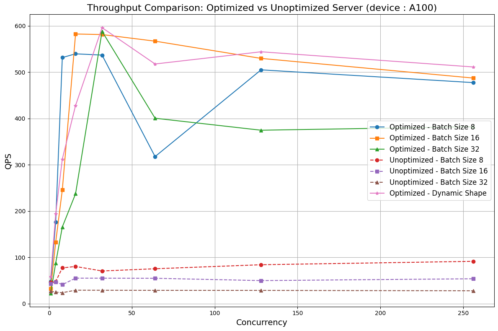
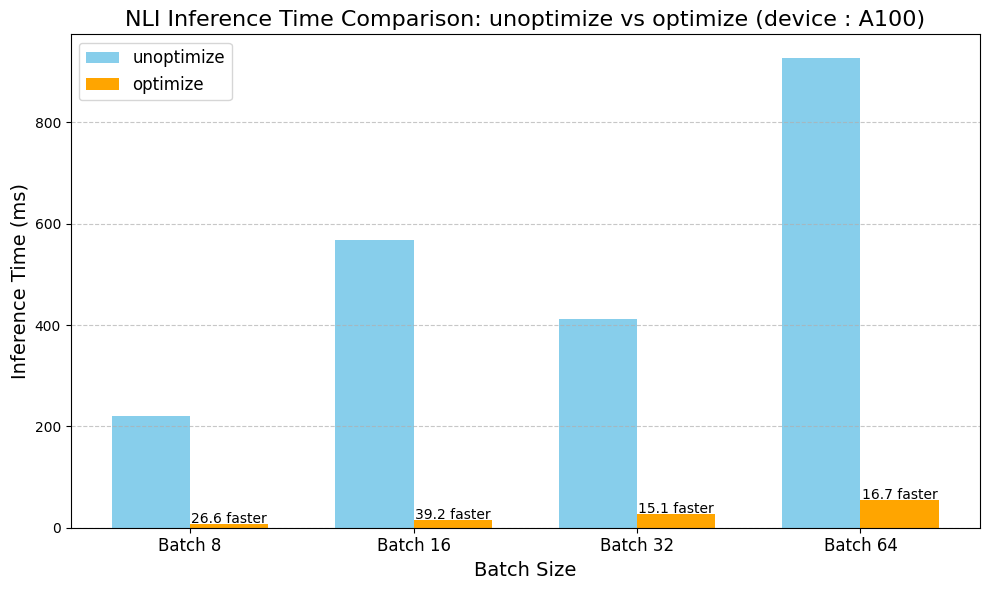

# TensorrtServer
## Embedding 推論


## Reranker 推論


## NLI 推論


## 配置 config.yaml
```yaml
nli_models:
  xlm-roberta-large-xnli:
    model_name: "xlm-roberta-large-xnli"
    model_path: "./nli_models/trt_models/nli_model_dynamic_bs.trt"
    tokenizer_path: "joeddav/xlm-roberta-large-xnli"

embedding_models:
  bge-m3:
    model_name: "bge-m3"
    model_path: "./embedding_models/trt_models/bge_m3_model_dynamic_bs.trt"
    tokenizer_path: "./embedding_models/bge-m3-tokenizer"

reranking_models:
  bge-reranker-large:
    model_name: "bge-reranker-large"
    model_path: "./reranker_models/trt_models/bge_reranker_large_dynamic_bs.trt"
    tokenizer_path: "./reranker_models/bge-reranker-large-tokenizer"
```

## 啟動
```bash
sh start_tensorrt_server.sh
```

## 使用
```python
import requests
url = "http://localhost:8000/infer/{}"
# embedding
r = requests.post(url.format("bge-m3"), json={"documents": ["文本"]})
"""
print(r.json())
{
    "embeddings" : [[]],
    "elapsed_ms" : xxx
}
"""

# reranker
payload = {
    "query": "Theory is essential for understanding machine learning.",
    "documents": ["Theory is essential for understanding machine learning."]
}
r = requests.post(url.format("bge-reranker-large"), json=payload)
"""
print(r.json())
{
    "scores" : [9.5078125],
    "elapsed_ms" : 5.78
}
"""

# nli
r = requests.post(url.format("xlm-roberta-large-xnli"), json={"premises":["P","P"], "hypotheses":["H","H2"]})
"""
print(r.json())
{
    "predictions" : ['contradiction', 'contradiction'],
    "logits" :  [[2.181640625, -1.3798828125, -0.71826171875], [1.0224609375, -0.42138671875, -0.65087890625]],
    "elapsed_ms" : 123.45
}
"""
```

## 使用(openai sdk)
**僅支援 embedding、rerank模型，nli模型不支援**
```python
from openai import OpenAI
client = OpenAI(
    api_key="EMPTY",  
    base_url="http://localhost:8000/v1"
)

# embedding
text = "The food was delicious and the waiter was friendly."
response = client.embeddings.create(
    input = [text, text],
    model = "bge-m3"
)

# reranker
documents = [
            "Machine learning is taught best through projects.",
            "Theory is essential for understanding machine learning.",
        ]
response = client.embeddings.create(
    model = "bge-reranker-large",
    input = documents,
    extra_body={"query": "Theory is essential for understanding machine learning."},
)
```