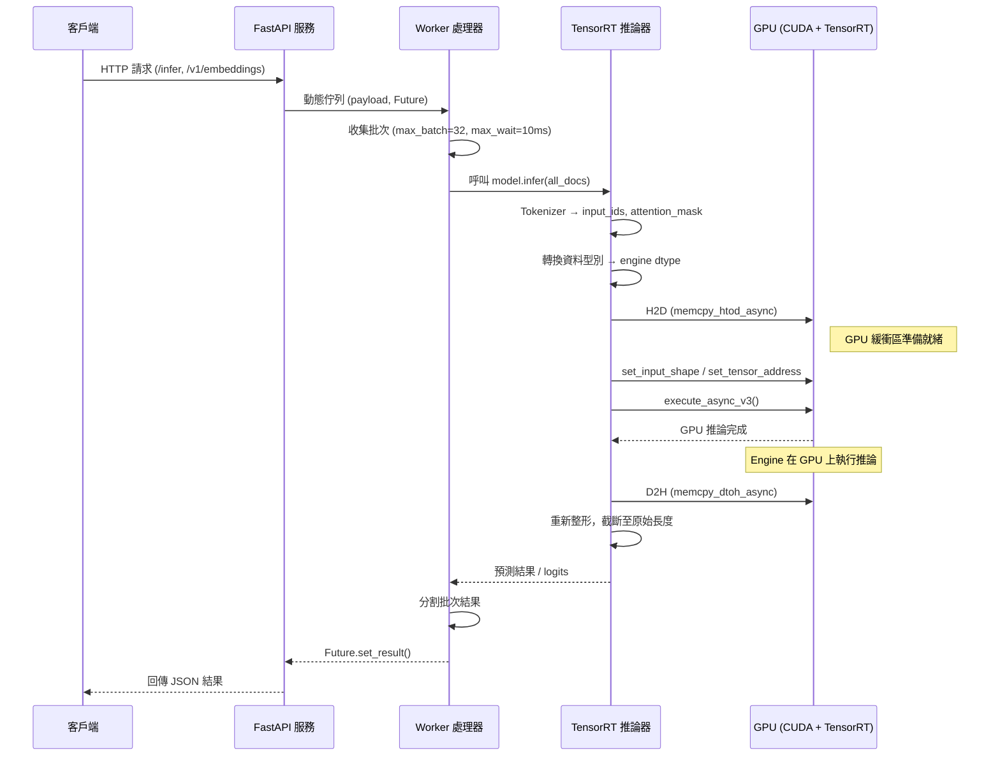

# TensorRT 模型推論服務器

一個基於 TensorRT 的高性能深度學習模型推論服務器，支援 Embedding、Reranker 和 NLI 模型的快速推論。

## 目錄

- [功能特色](#功能特色)
- [支援的模型](#支援的模型)
- [安裝與設定](#安裝與設定)
- [配置文件](#配置文件)
- [服務啟動](#服務啟動)
- [API 使用說明](#api-使用說明)
- [性能基準測試](#性能基準測試)
- [架構設計](#架構設計)

## 功能特色

- **高性能推論**: 基於 NVIDIA TensorRT 優化的模型推論
- **動態組批處理**: 支援自動批次聚合，提升推論效率
- **多模型支援**: 同時支援 Embedding、Reranker 和 NLI 模型
- **RESTful API**: 提供標準的 HTTP API 接口
- **OpenAI 相容**: 支援 OpenAI SDK 格式的 API 調用
- **GPU 記憶體優化**: 高效的 GPU 記憶體管理

## 支援的模型
**目前僅支援 Embedding、Reranker、NLI**


## 安裝與設定

### 1. 克隆專案

```bash
git clone https://github.com/FubonDS/TensorrtServer.git
cd TensorrtServer
```

### 2. 安裝依賴
**可參考`docker/docker-compose.yaml`作為基礎鏡像**
```bash
pip install -r requirements.txt
```

## 配置文件

編輯 `configs/config.yaml` 來配置您的模型：

```yaml
nli_models:
  xlm-roberta-large-xnli:
    model_name: "xlm-roberta-large-xnli"
    model_path: "./model/nlimodels/trtmodels/nli_model_dynamic_bs.trt"
    tokenizer_path: "joeddav/xlm-roberta-large-xnli"

embedding_models:
  bge-m3:
    model_name: "bge-m3"
    model_path: "./model/embedding_models/trt_models/bge_m3_model_dynamic_bs.trt"
    tokenizer_path: "./model/embedding_models/bge-m3-tokenizer"

reranking_models:
  bge-reranker-large:
    model_name: "bge-reranker-large"
    model_path: "./model/reranker_models/trt_models/bge_reranker_large_dynamic_bs.trt"
    tokenizer_path: "./model/reranker_models/bge-reranker-large-tokenizer"
```

### 配置說明

- `model_name`: 模型識別名稱
- `model_path`: TensorRT 模型文件路徑
- `tokenizer_path`: Tokenizer 路徑（可以是本地路徑或 Hugging Face 模型名稱）

## 服務啟動

### 方法 1: 使用腳本啟動

```bash
chmod +x start_tensorrt_server.sh
./start_tensorrt_server.sh
```

### 方法 2: 直接啟動

```bash
uvicorn TensorrtLauncher:app --host 0.0.0.0 --port 8887
```

服務啟動後，API 將在 `http://localhost:8887` 上提供服務。

## API 使用說明

服務提供兩種 API 格式：原生 API 和 OpenAI 相容 API。

### 查看可用模型

```bash
curl http://localhost:8887/models
```

回應：
```json
{
  "models": {
    "embedding_models": ["bge-m3"],
    "reranking_models": ["bge-reranker-large"],
    "nli_models": ["xlm-roberta-large-xnl"]
  }
}
```

### 原生 API 格式

#### 1. Embedding 推論

```python
import requests

url = "http://localhost:8887/infer/bge-m3"
payload = {"documents": ["這是一個測試文本", "另一個測試文本"]}
response = requests.post(url, json=payload)

print(response.json())
# 輸出:
# {
#     "embeddings": [[0.1, 0.2, ...], [0.3, 0.4, ...]],
#     "elapsed_ms": 15.2
# }
```

#### 2. Reranker 推論

```python
import requests

url = "http://localhost:8887/infer/bge-reranker-large"
payload = {
    "query": "機器學習的理論很重要",
    "documents": [
        "理論對於理解機器學習非常重要",
        "實作經驗在機器學習中也很關鍵"
    ]
}
response = requests.post(url, json=payload)

print(response.json())
# 輸出:
# {
#     "scores": [9.5078125, 7.2421875],
#     "elapsed_ms": 5.78
# }
```

#### 3. NLI (自然語言推理) 推論

```python
import requests

url = "http://localhost:8887/infer/xlm-roberta-large-xnli"
payload = {
    "premises": ["今天天氣很好", "貓是動物"],
    "hypotheses": ["今天是晴天", "狗是動物"]
}
response = requests.post(url, json=payload)

print(response.json())
# 輸出:
# {
#     "predictions": ["entailment", "neutral"],
#     "logits": [[2.18, -1.38, -0.72], [1.02, -0.42, -0.65]],
#     "elapsed_ms": 12.45
# }
```

### OpenAI 相容 API

**注意**: 僅支援 Embedding 和 Reranker 模型，NLI 模型不支援此格式。

#### 1. Embedding API

```python
from openai import OpenAI

client = OpenAI(
    api_key="EMPTY",  # 任意值即可
    base_url="http://localhost:8887/v1"
)

text = "這是一個測試文本"
response = client.embeddings.create(
    input=[text],
    model="bge-m3"
)

print(response.data[0].embedding)
```

#### 2. Reranker API

```python
from openai import OpenAI

client = OpenAI(
    api_key="EMPTY",
    base_url="http://localhost:8887/v1"
)

documents = [
    "機器學習最好通過專案來學習",
    "理論對於理解機器學習很重要"
]

response = client.embeddings.create(
    model="bge-reranker-large",
    input=documents,
    extra_body={"query": "理論對於理解機器學習很重要"}
)

# 取得重排序分數
scores = [data.embedding for data in response.data]
print(scores)
```

### 請求參數說明

#### Embedding 請求
- `documents` (required): 字串或字串列表，要編碼的文本
- `model` (optional): 模型名稱，在 OpenAI API 中為必需

#### Reranker 請求
- `query` (required): 查詢字串
- `documents` (required): 候選文件列表
- `model` (optional): 模型名稱，在 OpenAI API 中為必需

#### NLI 請求
- `premises` (required): 前提句子列表
- `hypotheses` (required): 假設句子列表

### 回應格式說明

#### Embedding 回應
```json
{
  "embeddings": [[0.1, 0.2, ...]], // 向量列表
  "elapsed_ms": 15.2               // 推論時間（毫秒）
}
```

#### Reranker 回應
```json
{
  "scores": [9.5078125],           // 相關性分數列表
  "elapsed_ms": 5.78               // 推論時間（毫秒）
}
```

#### NLI 回應
```json
{
  "predictions": ["entailment"],   // 預測標籤列表
  "logits": [[2.18, -1.38, -0.72]], // 原始分數
  "elapsed_ms": 12.45              // 推論時間（毫秒）
}
```

#### NLI 標籤說明
- `entailment`: 蘊含（前提支持假設）
- `neutral`: 中性（前提與假設無關）
- `contradiction`: 矛盾（前提與假設衝突）

## 性能基準測試

以下為在 NVIDIA A100 GPU 上的測試結果：

### Embedding 推論性能


**測試配置**:
- 模型: BGE-M3
- 批次大小: 1-64
- 推論比較對象: torch v.s TensorRT
- 推論 Server 對象: 串行推論 v.s 動態組批


### Reranker 推論性能


**測試配置**:
- 模型: BGE-Reranker-Large
- 批次大小: 1-64
- 推論比較對象: torch v.s TensorRT
- 推論 Server 對象: 串行推論 v.s 動態組批

### NLI 推論性能


**測試配置**:
- 模型: XLM-RoBERTa-Large-XNLI
- 批次大小: 1-64
- 推論比較對象: torch v.s TensorRT
- 推論 Server 對象: 串行推論 v.s 動態組批

## 架構設計

### 系統架構圖

